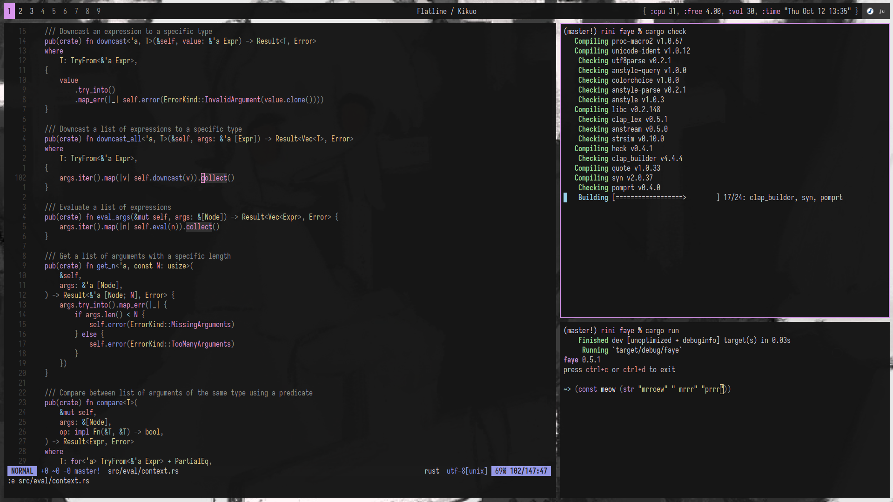

# Dedodated files

## Software

- Desktop: `bspwm`, `sxhkd`, `picom`, `polybar`, `dunst`
- Apps: `alacritty`, `rofi`, `neovim`, `zsh`, `mpd`

Some stuff referenced in the dotfiles:

- WM: `fcitx` (IME), `nitrogen` (wallpaper), `unclutter` (hide mouse)
- Apps: `cantata` (MPD client), `flameshot` (screenshots)
- A lot more probably. You can go through [my packages](pkglist.txt)

## Installation

Probably you won't want to steal all my files outright, but feel free to. It's probably not even
copyrightable, but it's all under CC0 anyway.

Dotfiles are managed by git directly, but to avoid tools from exploding by scanning your whole home
directory thinking its a normal repository, the `.git` directory is renamed to `.notgit`:

    git init --bare ~/.notgit

You can use that command to create your own dotfiles repo. Adding and commiting files works as
usual, with some options added:

    alias dots="git --git-dir .notgit --work-tree ~"

Easy right? Some other useful commands:

    # make git ignore non-commited files
    echo "*" > ~/.notgit/info/exclude
    dots config status.showUntrackedFiles

    # do this if you'd like to remove a file but keep it in the repo
    rm ~/README.md
    dots update-index --assume-unchanged ~/README.md    # gaslighting :)
