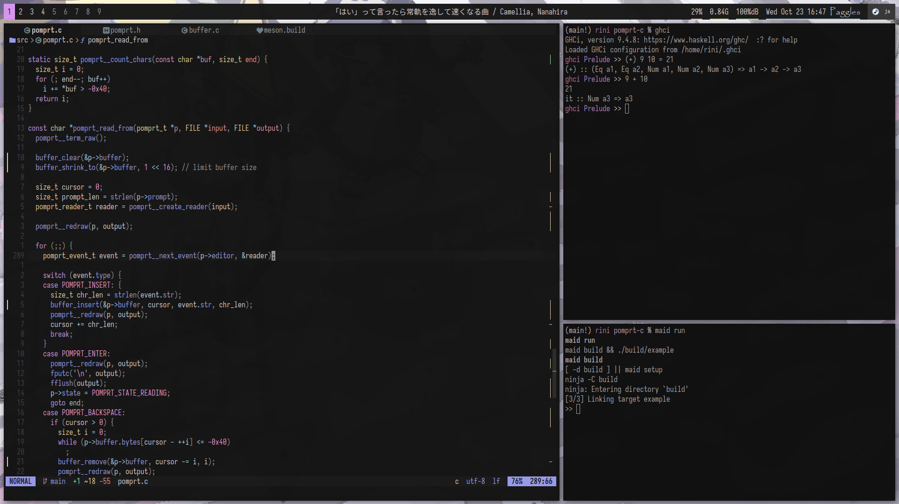

# dots


*(wallpaper by [cagelabyrinth](https://cagelabyrinth.tumblr.com) - [post on twitter](https://twitter.com/cagelabyrinth/status/1482451201728090112?s=20) / [media url](https://pbs.twimg.com/media/FJK5dsxaUAAMpht?format=jpg&name=large))*

## stuff used

- alacritty
- bspwm
- dunst
- neovim
- picom
- polybar
- rofi (unconfigured for now)
- sxhkd
- zsh

## management

my dotfiles are managed by creating a bare git repo at `~/.notgit` with the work tree being the home dir:

```zsh
alias dots="git --git-dir .notgit --work-tree ~"
```

this can be easily setup by running `git init --bare ~/.notgit` and putting the alias in your shell's rc

optionally:

- run `dots config status.showUntrackedFiles no` (avoids cluttering `dots status`)
- use a `.notgit/info/exclude` like this:

  ```gitignore
  /*
  !.config
  !.local/bin
  !.xinitrc
  !.zlogin
  !.zprofile
  !.zshrc
  ```

then, to use the repo on a new machine, you can simply set the alias and run `dots clone --bare .notgit`, followed by `dots checkout` and a lil conflict resolving (or be chaotic and use `--force`, overwriting data)

it's a neat trick I've seen others do! no symlink spaghetti needed, or any special tooling
